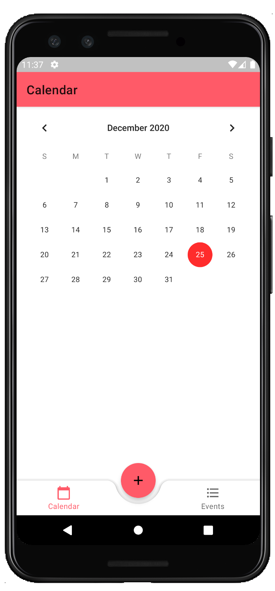
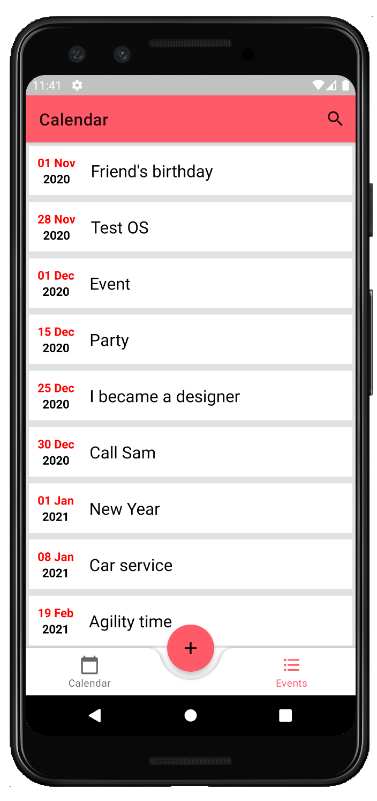
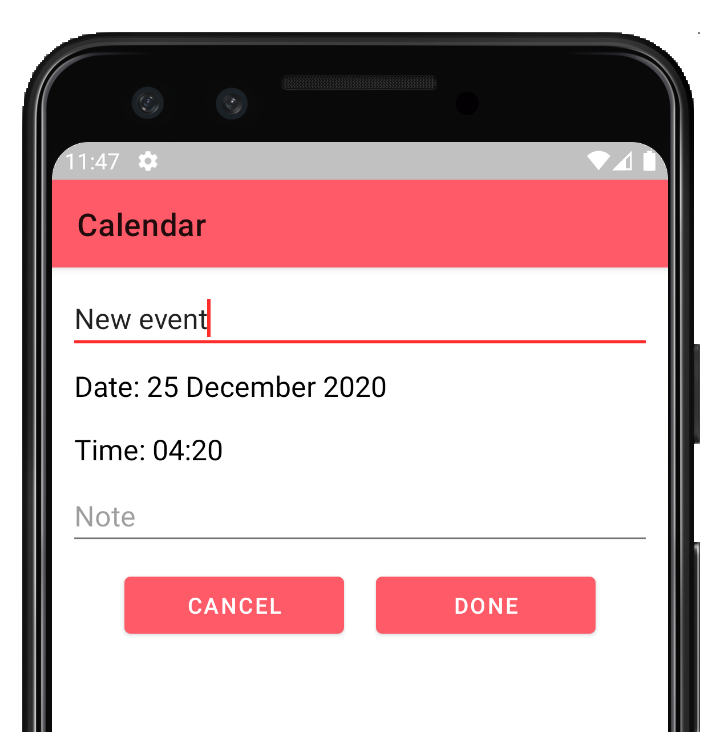
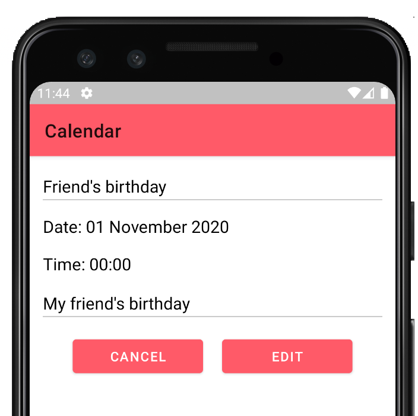
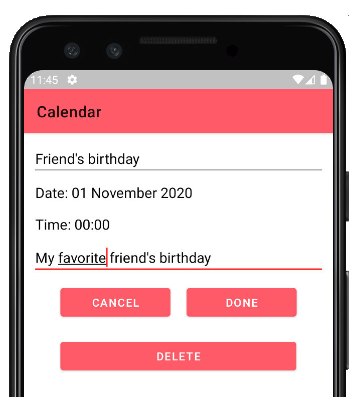
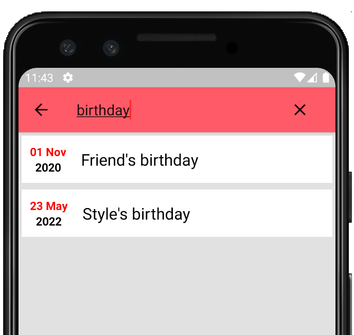

#Calendar App OOP

It is a course project of object-oriented programming university course.

This is an Android application on Kotlin programming language. The application is a calendar with the ability to add, edit and delete events on date. 

##Calendar start layout
* On date click opens a layout with events that occur on and after the selected date.

##Events layout
* On any event click opens a dialog with event information: title, date, time and notes.
* On floating "+" button click opens dialog for creating an event.

##Add events
* Field "Title" is required.
* By default, the date is current.
* Field "Note" is optional.

##View events full information
* Event information is readonly.
* On "edit" button click makes it possible to edit event.

##Edit events
* Is possible to edit all event information: title, date, time and note.

##Search events by title
* At the top of layout with events on top bar click opens search field.

